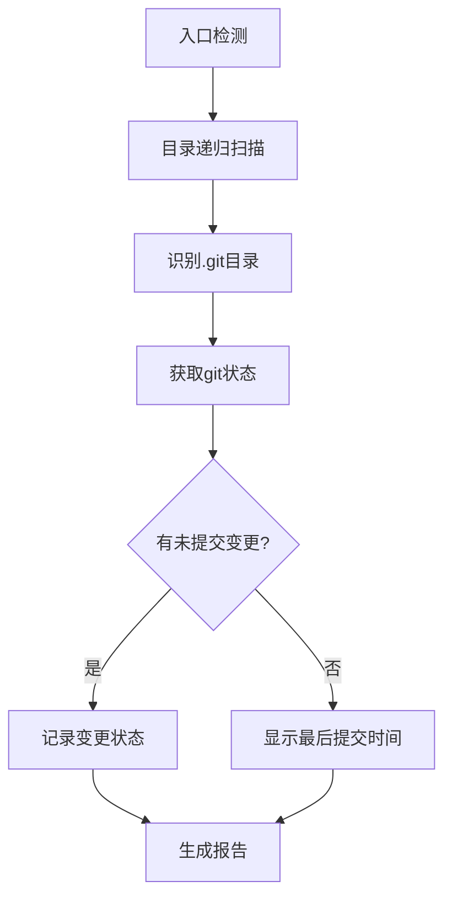

# gitcheck-cli

🔍 扫描指定目录下的Git仓库提交状态并执行自动化操作

## 功能特性 / Features

- 🇨🇳 快速扫描目录树中的Git仓库  
  🇬🇧 Rapidly scan directory trees for Git repositories
- 🇨🇳 显示仓库最后提交状态及变更  
  🇬🇧 Display last commit status and local changes
- 🇨🇳 智能重试失败的git push操作  
  🇬🇧 Smart retry for failed git push operations
- 🇨🇳 多层级目录递归检测  
  🇬🇧 Multi-level directory recursive detection

## 安装说明

```bash
npm install -g gitcheck-cli
```

## 使用示例

```bash
# 扫描当前目录
gitcheck -d .

# 扫描上级目录
gitcheck -d ../

# 带重试的git push
gitcheck -gp ./project
```

## 参数说明 / Parameters

| 选项/Options        | 描述/Description                                                                 |
|---------------------|---------------------------------------------------------------------------------|
| `-d, --dir <path>`  | 🇨🇳 指定扫描目录路径 (默认: 当前目录)  
🇬🇧 Specify target directory (default: current) |
| `-gp, --gitpush`    | 🇨🇳 执行带自动重试的git push  
🇬🇧 Execute git push with auto-retry                          |

## 实现原理 / Architecture



1. **核心流程**  
   - 递归遍历算法检测.git目录  
   - 通过child_process执行git命令  
   - 指数退避算法实现push重试 (最大3次，间隔2s/4s/8s)

2. **跨平台支持**  
   - 自动转换Windows/Linux路径格式  
   - 处理文件系统权限差异

## 全局选项

```
Options:
  -h, --help       显示帮助信息
  -v, --version    显示版本号
  --verbose        显示详细输出
```
